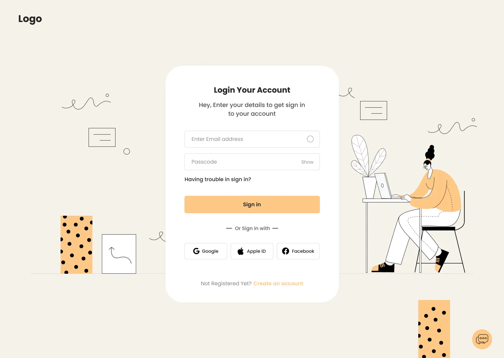
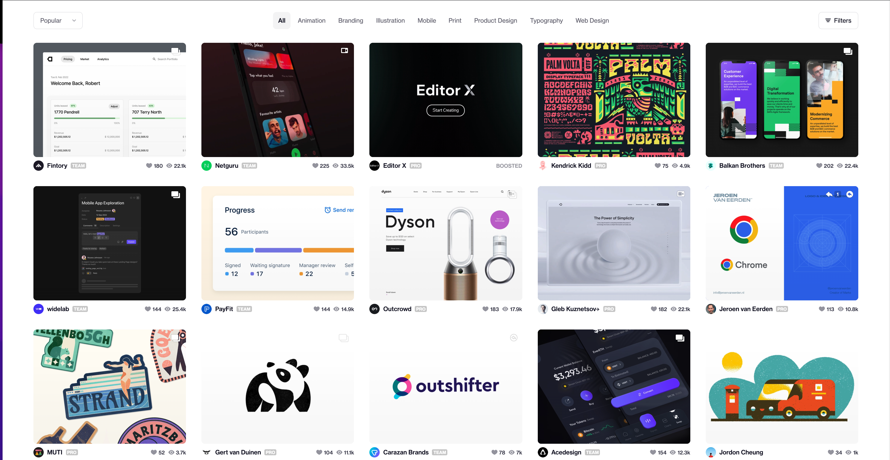

# Évaluation Technique: Application d'Authentification et de Visualisation d'Images

## Présentation du Projet

Cette étude de cas consiste à développer une application web complète permettant aux utilisateurs de s'authentifier, de visualiser des images provenant d'une API externe, et d'interagir avec ces images via un système de "likes".

## Fonctionnalités Requises

### 1. Système d'Authentification

**Objectif:** Reproduire fidèlement l'interface d'authentification présentée ci-dessus.

**Spécifications:**
- Implémenter les scénarios d'authentification suivants:
  - `muser1/mpassword1` → Authentification réussie
  - `muser2/mpassword2` → Authentification réussie
  - `muser3/mpassword3` → Affichage du message d'erreur: "Ce compte a été bloqué."
  - Toute autre combinaison → Affichage du message d'erreur: "Informations de connexion invalides"
- Soigner l'expérience utilisateur avec des transitions et validations appropriées

### 2. Galerie d'Images

**Objectif:** Développer une interface de visualisation d'images utilisant l'API Unsplash.

**Spécifications:**
- Intégrer l'API [Unsplash](https://unsplash.com/developers) (nécessite la création d'un compte développeur)
- Afficher les images dans une interface responsive et esthétique
- Implémenter un système de pagination ou d'infinite scrolling pour optimiser le chargement
- Gérer les états de chargement et d'erreur de manière élégante

### 3. Système de Likes

**Objectif:** Permettre aux utilisateurs de "liker" les images et conserver leurs préférences.

**Spécifications:**
- Ajouter une icône de "like" clairement visible sous chaque image
- Implémenter un état visuel distinct pour les images déjà "likées" par l'utilisateur connecté
- Synchroniser ces données avec une base de données côté client
- Assurer que les "likes" sont persistants entre les sessions

## Contraintes Techniques

- **Framework:** NextJS (dernière version stable)
- **Base de données côté client:** [Level](https://github.com/Level/level) ou équivalent pour stocker les informations des "likes" par utilisateur
- **Responsive Design:** L'application doit s'adapter aux formats desktop et mobile
- **Qualité du code:** Structure claire, commentaires pertinents, et respect des bonnes pratiques

## Critères d'Évaluation

- Fidélité à la maquette d'authentification fournie
- Fonctionnalité de l'intégration avec l'API Unsplash
- Performance et optimisation (notamment pour le chargement des images)
- Qualité de l'interface utilisateur et expérience utilisateur
- Propreté et maintenabilité du code
- Gestion des erreurs et cas limites

## Livrables

- Lien vers le repository GitHub contenant le code source complet du projet
- Instructions claires pour l'installation et le lancement du projet en local
- Documentation des choix techniques effectués (dans un fichier README.md)

---

Bonne chance dans la réalisation de ce projet d'évaluation! N'hésitez pas à faire preuve de créativité tout en respectant les contraintes et fonctionnalités demandées.